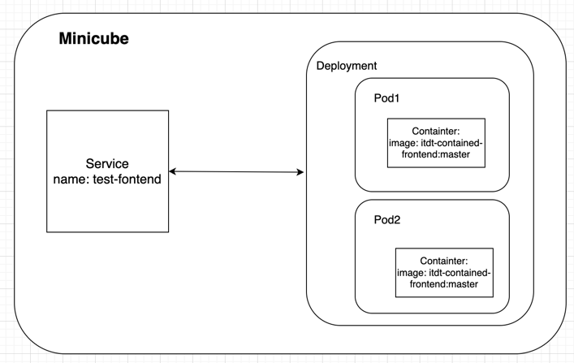

University: [ITMO University](https://itmo.ru/ru/)\
Faculty: [FICT](https://fict.itmo.ru)\
Course: [Introduction to distributed technologies](https://github.com/itmo-ict-faculty/introduction-to-distributed-technologies)\
Year: 2023/2024\
Group: K4111c\
Author: Bolychev Egor Alekseevich\
Lab: Lab 2\
Date of create: 26.11.2023\
Date of finished: 27.11.2023
## Лабораторная работа №2 "Развертывание веб сервиса в Minikube, доступ к веб интерфейсу сервиса. Мониторинг сервиса."

Далее был создан service с типом NodePort с единственным портом ```3000```:

```bash 
kubectl apply -f service.yaml
```

После чего был создан файл для разворачивания пода, на котором будет находиться контейнер с itdt-contained-frontend:

```bash 
kubectl apply -f deployment.yaml
```

Дальнейшее наблюдение можно делать через следующие команды:

```bash 
kubectl get po # Покажет все доступные поды в namespace
```

```bash 
minikube dashboard # Откроет дашборд в виде UI со всей актуальной информации по каждому namespace
```

```bash 
kubectl logs <pod-name> # Покажет все логи внутри указанного пода
```

После разворачивания сервиса была получена следующая страница:


При написании ```deployment.yaml``` переменные окружения были указаны как:
* ```REACT_APP_USERNAME: EGOR```
* ```REACT_APP_COMPANY_NAME: FB```

Схема организации :

