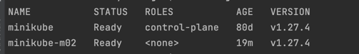
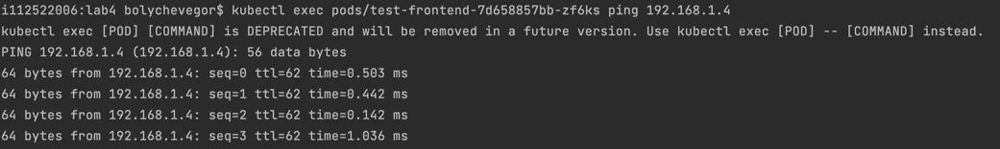
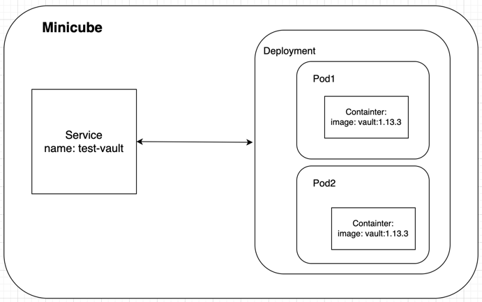

University: [ITMO University](https://itmo.ru/ru/)\
Faculty: [FICT](https://fict.itmo.ru)\
Course: [Introduction to distributed technologies](https://github.com/itmo-ict-faculty/introduction-to-distributed-technologies)\
Year: 2023/2024\
Group: K4111c\
Author: Bolychev Egor Alekseevich\
Lab: Lab 4\
Date of create: 26.11.2023\
Date of finished: 27.11.2023
## Лабораторная работа №4 "Сети связи в Minikube, CNI и CoreDNS"

Для запуска minikube с подключенными плагинами CNI и 2 нодами была выполнена команда:

```bash
minikube start --network-plugin=cni --cni=calico
minikube node add
```

Было проверено наличие 2х nodes:



Далее были проставлены label для nodes:

```bash
kubectl label nodes minikube itmo=first
kubectl label nodes minikube-m02 itmo=second
```

Был создан calico.cfg для calico и удаляем дефолтный ippool:

```bash
calicoctl delete ippools default-ipv4-ippool --config=calico.cfg.yaml --allow-version-mismatch
```

Были созданы собственные ippool:

```bash
calicoctl apply -f calico.yaml --config=calico.cfg.yaml --allow-version-mismatch
```


Был создан config-map:

```bash 
kubectl apply -f config-map.yaml
```

Далее был создан service с типом NodePort с единственным портом ```3000```:

```bash 
kubectl apply -f services.yaml
```

После чего был создан файл для разворачивания пода, на котором будет находиться контейнер с itdt-contained-frontend:

```bash 
kubectl apply -f deployment.yaml
```

Дальнейшее наблюдение можно делать через следующие команды:

```bash 
kubectl get po # Покажет все доступные поды в namespace
```

```bash 
minikube dashboard # Откроет дашборд в виде UI со всей актуальной информации по каждому namespace
```

```bash 
kubectl logs <pod-name> # Покажет все логи внутри указанного пода
```

После разворачивания сервиса и проброса портов:


При заходе внутрь одного из подов, второй успешно пинговался:



Схема организации:


